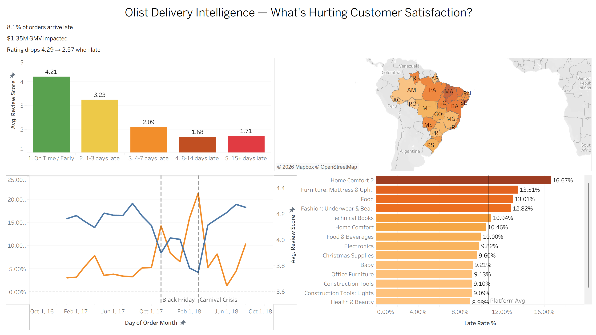
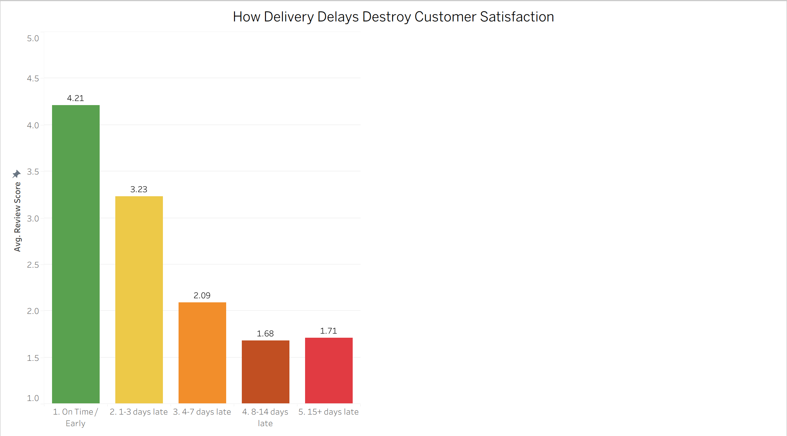
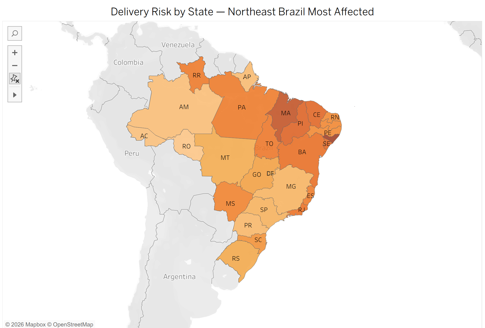
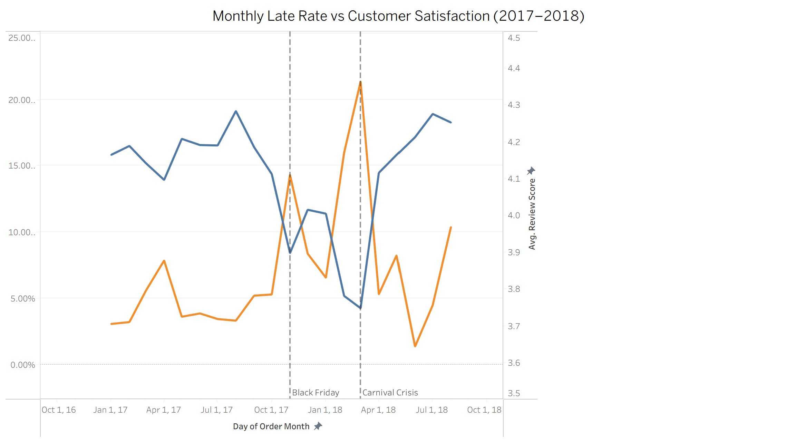
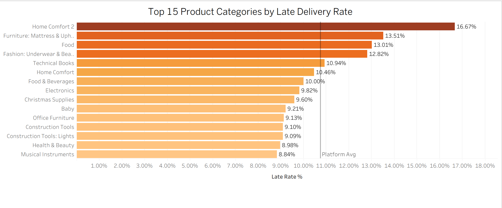

# Olist Delivery Intelligence — What's Hurting Customer Satisfaction?

**SQL analysis and Tableau dashboard on delivery performance and customer satisfaction using real Brazilian e-commerce data (2016–2018).**

**[Live Dashboard → Tableau Public](https://public.tableau.com/app/profile/sai.venkat.reddy.seri/viz/OlistDeliveryIntelligence/Dashboard1)**

---

## Business Question

*What is the cost of late deliveries on Olist — and which states, categories, and sellers are the biggest risk?*

Olist is a Brazilian e-commerce marketplace connecting small businesses to major retailers. With ~100k real orders across 2016–2018, this dataset offers a clear window into how delivery performance drives — or destroys — customer satisfaction.

---

## Dashboard



---

## Key Findings

**1. 8.1% of orders arrive late, but the satisfaction impact is disproportionate.**
Late orders average a 2.57-star review vs 4.30 for on-time orders — a 1.73-point gap on a 5-point scale.

**2. Just 1–3 days of delay costs a full review point.**
On-time orders average 4.29 stars. Orders 1–3 days late drop immediately to 3.29. By 4–7 days late, the average is 2.09. After 8 days, customers are already at ~1.7 stars regardless of how much later it gets — the damage is done early.

**3. $1.35M in GMV (8.76% of total) went to customers who gave an average 2.57 stars.**
Late orders also skew slightly higher in value ($172 avg vs $158 for on-time), meaning higher-value purchases are disproportionately affected.

**4. Brazil's northeast is a delivery risk zone.**
Alagoas (AL) has a 23.75% late rate. Maranhão (MA) is at 19.61%. São Paulo (SP), near the main logistics hub, sits at just 5.88%. The geographic divide maps directly onto Brazil's logistics infrastructure gap.

**5. Two operational crises are visible in the data.**
November 2017 (Black Friday): late rate spiked to 14.3%, review scores fell to 3.99.
February–March 2018 (Carnival season): late rate hit 21.37% — the worst month in the dataset — with review scores dropping to 3.81. The platform recovered sharply; June 2018 was the cleanest month at 1.36% late.

**6. Home Comfort, Food, and Fashion categories have the highest late rates.**
Fashion: Underwear & Beach shows the biggest satisfaction drop when late (2.34-point drop), making it the highest-risk category for customer experience.

---

## Charts

### Satisfaction Cliff — How delays destroy review scores


### Delivery Risk by State — Northeast Brazil most affected


### Monthly Trend — Two operational crises in the data


### Top 15 Categories by Late Delivery Rate


---

## Tech Stack

| Layer | Tool |
|---|---|
| Database | PostgreSQL 16 |
| Analysis | SQL (window functions, CTEs, date math) |
| Visualization | Tableau Public |
| Dataset | Brazilian E-Commerce Public Dataset by Olist |

---

## Dataset

**Source:** [Brazilian E-Commerce Public Dataset by Olist](https://www.kaggle.com/datasets/olistbr/brazilian-ecommerce) — Kaggle

9 relational tables, ~100k real orders, 2016–2018.

| Table | Rows |
|---|---|
| customers | 99,441 |
| orders | 99,441 |
| order_items | 112,650 |
| order_payments | 103,886 |
| order_reviews | 98,410 |
| products | 32,951 |
| sellers | 3,095 |
| geolocation | 1,000,163 |
| product_category_name_translation | 71 |

---

## How to Reproduce

**1. Download the dataset** from the Kaggle link above and unzip to a local folder.

**2. Create the PostgreSQL database and schema:**
```sql
CREATE DATABASE olist;
```
Then connect to `olist` and run `sql/schema.sql`.

**3. Load the CSVs** using psql (replace the path with your local folder):
```sql
\COPY customers FROM '/path/to/olist_customers_dataset.csv' DELIMITER ',' CSV HEADER;
\COPY sellers FROM '/path/to/olist_sellers_dataset.csv' DELIMITER ',' CSV HEADER;
\COPY products FROM '/path/to/olist_products_dataset.csv' DELIMITER ',' CSV HEADER;
\COPY product_category_name_translation FROM '/path/to/product_category_name_translation.csv' DELIMITER ',' CSV HEADER;
\COPY orders FROM '/path/to/olist_orders_dataset.csv' DELIMITER ',' CSV HEADER;
\COPY order_items FROM '/path/to/olist_order_items_dataset.csv' DELIMITER ',' CSV HEADER;
\COPY order_payments FROM '/path/to/olist_order_payments_dataset.csv' DELIMITER ',' CSV HEADER;
\COPY geolocation FROM '/path/to/olist_geolocation_dataset.csv' DELIMITER ',' CSV HEADER;
```

For order_reviews (handles duplicate review_ids in the raw data):
```sql
CREATE TEMP TABLE order_reviews_staging (LIKE order_reviews);
\COPY order_reviews_staging FROM '/path/to/olist_order_reviews_dataset.csv' DELIMITER ',' CSV HEADER ENCODING 'LATIN1';
INSERT INTO order_reviews
SELECT DISTINCT ON (review_id) * FROM order_reviews_staging
ORDER BY review_id, review_creation_date;
```

**4. Run the analysis queries** in `sql/analysis.sql` — 8 queries covering delivery performance, geographic breakdown, category risk, monthly trends, and seller analysis.

**5. View the dashboard** on [Tableau Public](https://public.tableau.com/app/profile/sai.venkat.reddy.seri/viz/OlistDeliveryIntelligence/Dashboard1) or open `olist_dashboard.twbx` in Tableau Public desktop.

---

## Repository Structure

```
olist-delivery-intelligence/
├── sql/
│   ├── schema.sql          # PostgreSQL table definitions
│   └── analysis.sql        # 8 analysis queries
├── images/                 # Dashboard and chart screenshots
├── olist_dashboard.twbx    # Tableau Public packaged workbook
└── README.md
```
